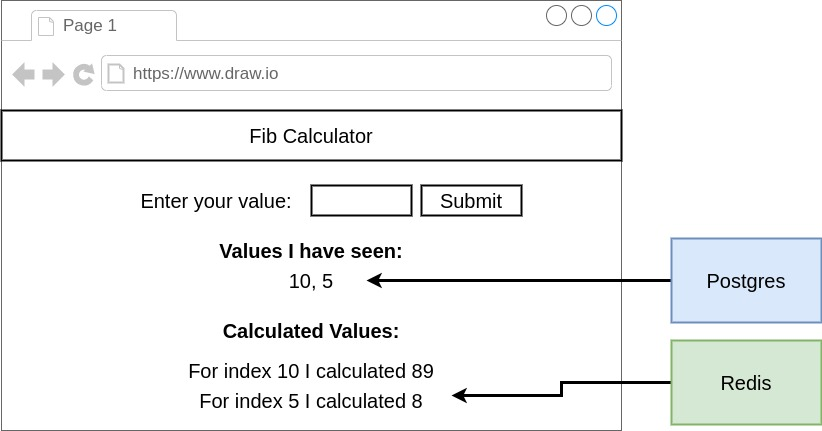
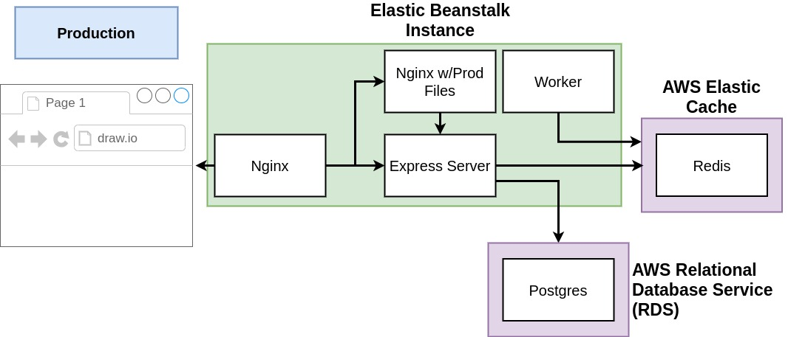
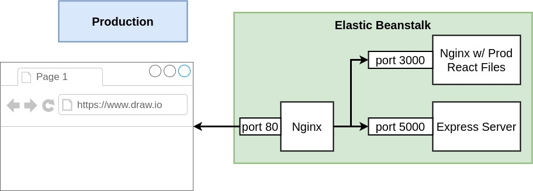

# Multi-container Deployment on AWS

## Table of Contents

- [General info](#general-info)
- [Project Overview](#project-overview)
- [Setup](#setup)
- [To-do List](#To-do-List)
- [Reference](#reference)

## General Info

This repository contains a project from the course, [Docker and Kubernete: The Complete Guide](https://www.udemy.com/docker-and-kubernetes-the-complete-guide). The project aims to build a simple web application using the [Amazon Web Service](https://cloud.google.com/) (AWS) Beanstalk, a set of tools and services including a web hosting service. I have built and host a React application on AWS.

## Project Overview

Above result is the result of this project, the simple web application.
If we type any value, [Fibonacci Number](https://en.wikipedia.org/wiki/Fibonacci_number/) is calculated with respect to the submitted value. <strong>"Value I have seen:"</strong> shows the history of the submitted values. and <strong>"Calculated Values:"</strong> shows the history of pair of information: submitted value and its Fibonacci number

Above figure shows the architecture of this project. The architectue is applied on the AWS at the end of this project.
The architecture is comprised of three main components, AWS Elastic Beanstalk Instance, AWS Elastic Cache, and AWS Relational Database Service (RDS).

### Elastic Beanstalk Instance

Elastic Beanstalk can handle the deployment automatically from capacity provisioning, load balancing, auto-scaling to application health monitoring.

1. Nginx

   [Nginx](https://www.nginx.com/) is used as a reverse proxy to map an application to the Elastic Load Balancing load balancer on port 80. In this project, Nginx is the only communicator between the Elastic Beanstalk Instance. Nginsx all the request from the user of the web application and send the request to the Express server and React Server. Such a way of communication makes it simpler and safer when there are multiple Elastic Beanstalk instances.

2. React Server
   React server generates the simple web application running on [React APP](https://reactjs.org/docs/create-a-new-react-app.html). The server litsens the request from the Nginx and work on rendering outputs on the web application. For the detail, check the [client](client) directory.

3. Express Server

   Express server save the information of the submitted data and make Worker make the output and save to the AWS Elastic Cache. For the workflow, check [server](server) directory.

4. Worker

   [Worker](worker) calculates the Fibonacci number.

### AWS Elastic Cache and AWS RDS

In this projects, AWS Elastic Cache handles the [Redis](https://redis.io/), in-memory data structure store. Redis is used to save the history of the pair of information: submitted value and its Fibonacci number. AWS RDS deals with the [Postgres](https://www.postgresql.org/) to store the history of the submitted values.

## Reference

[1] Stephen's Github (https://github.com/StephenGrider/DockerCasts/tree/master/diagrams)
